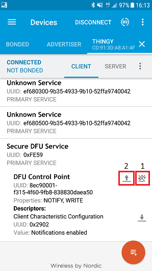

**************************************
Upgrading with nRF Connect for Mobile
**************************************

Prepare your device for DFU by replacing the existing
bootloader with one that uses your own public key.

-  Build a new bootloader by compiling the Bootloader project using
   either Keil μVision or GCC. Program the compiled bootlaoder onto the
   device. Remember to program the Softdevice as well for the OTA-DFU to
   function properly.

-  Copy the `public_key.c` file to
   <InstallFolder>\project\bootloader_secure\dfu_public_key.c.

The following procedure requires a phone or tablet with `nRF
Connect for
mobile <https://www.nordicsemi.com/eng/Products/Nordic-mobile-Apps/nRF-Connect-for-mobile-previously-called-nRF-Master-Control-Panel>`__
installed to run DFU.

1. Transfer the zip package that will be used for DFU to your phone.

2. Power on the device. Open nRFConnect on your phone.

3. Tap **Scan**. From the list of discovered devices, connect to your
   device.

.. note::
    The discovered devices list is not automatically refreshed when they
    stop advertising. Whenever you have problems connecting to a device from
    the list, try refreshing the list.

4. Expand the Secure DFU Service section. There are two icons to the
   right of the DUF Control Point area.

   a. The icon to the right turns notifications on/off. Make sure they
      are enabled (the icon must be crossed)

   b. Tap the icon to the left to put the device into bootloader (DFU)
      mode. Tap **OK** when prompted to reset the device.

|image1| |image2|

Activating DFU mode
--------------------

.. note::
    The device now enters DFU mode. Go to the **Scanner** tab and start
    scanning. A device with the same name but “DFU” added appears in the list of
    discovered devices.

5. Connect to the new device by tapping the DFU icon.

.. image:: images/image3.png
   :width: 1.84in
   :height: 3.28in

Running DFU
------------

5. Select **Distribution packet (ZIP)** and navigate to the package that
   you previously uploaded to your mobile.

Uploading the ZIP file
-----------------------

6. The package is now uploaded to the device

.. |image2| image:: images/image2.png
   :width: 1.87in
   :height: 3.33in
